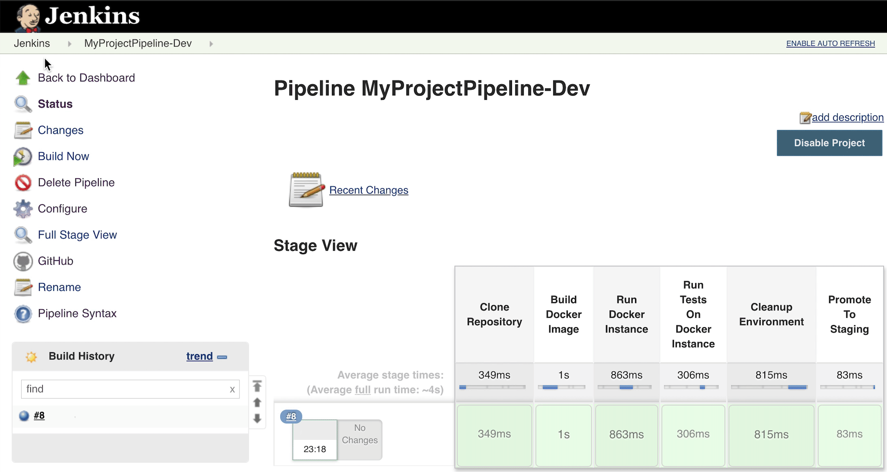

<div align="center" id="overwatch">
    
</div>

# <div align="center">Overwatch &middot; [](LICENSE) </div>

-   [Introduction](#introduction)
-   [System Architecture](#system-architecture)
-   [Setup](#setup)
    -   [Installation & Deployment](#installation)
-   [Usage](#usage)
    -   [Browser Access](#browser-access)
    -   [Commands](#commands)
-   [Demo](#demo)
-   [Future](#future)
-   [Resources](#resources)

## Introduction

Millions of developers use AWS to bring products and services to people around the world. Code is not perfect and neither are the people writing it. Those overseeing operations need to be able to assess their deployments at all times. To help with this task, I have created Overwatch.

I have used [AWS](https://aws.amazon.com/), [Docker](https://www.docker.com/), [Prometheus](https://github.com/prometheus/prometheus), and [Grafana](https://github.com/grafana/grafana) to develop a monitoring solution that provides oversight for CI/CD pipelines running in the cloud so that auditors and operation’s personnel can quickly assess the health of mission-critical infrastructure.

The tight integration of Overwatch’s components allows personnel overseeing operations to assess failures quickly.

## System Architecture

<p align="center">
    
</p>

CloudWatch, Prometheus, and Node Exporter - each in their own Docker container - monitor an EC2 instance on AWS. Jenkins is running on the EC2 instance which is connected to the internet. When prompted via command, Jenkins begins running a CI/CD pipeline. This pipeline creates a Docker container where CentOS (Linux distribution) is virtualized. A GitHub repository is then cloned. The project in this repo is built and integration tests are run. The results of these integration tests are then relayed to Grafana for a user to see.

## Setup

**Cloudwatch-Exporter**

Put your AWS credentials into `cloudwatch-exporter.dockerfile`

```
ENV AWS_ACCESS_KEY_ID=value \
    AWS_SECRET_ACCESS_KEY=value
```

<details id="installation">
    <summary><b>Installation & Deployment</b></summary>

1. Install Docker ([Mac](https://docs.docker.com/docker-for-mac/install/), [Windows](https://docs.docker.com/docker-for-windows/install/), [Linux](https://docs.docker.com/engine/install/))
2. Clone this repository
3. In the project directory run `docker-compose up`
4. Navigate to [localhost:3000](http://localhost:3000) in a browser (If prompted to login, username: `admin`, password: `admin`)
5. On the left sidebar, select Configuration > Data Sources
6. Select Prometheus, set the HTTP URL to the IPv4 address of your EC2 instance with port number 9090; `ec2-[IP-address-goes-here].compute-1.amazonaws.com:9090`
7. On the left sidebar, select Dashboards > Manage
8. Select New Dashboard

</details>

## Usage

### Browser Access

Prometheus: [http://localhost:9090](http://localhost:9090)

Alertmanager: [http://localhost:9093](http://localhost:9093)

Grafana: [http://localhost:3000](http://localhost:3000)

### Commands

Prometheus Reload: `curl -X POST http://localhost:9090/-/reload`

Prometheus Health Check: `curl http://localhost:9090/-/healthy`

CloudWatch Exporter Reload: `curl -X POST http://localhost:9106/-/reload`

## Demo

<div align="center">
    
    <p>Docker</p>
    
    <p>Jenkins</p>
    
    <p>Grafana</p>
</div>

## Future

-   [x] Dockerize the project

    -   Advantages
        -   Keeping the processes in separate images (and thus running them in separate containers) permits each to be maintained independently. Further, each process can be secured independently.
        -   Keeping the processes in their own containers permits the running of one Prometheus container and one Grafana container for multiple containers.
        -   Along the same line, there is more flexibility in relocating containers, potentially dropping Grafana to use a Grafana hosted service, etc.
    -   Engineering Challenge
        -   Dockerizing each monitoring platform meant that the metrics needed to be pulled from a local server instead of the platforms themselves.

-   [x] Alertmanager support

    -   Setup the Alertmanager config in [alertmanager.yml](alertmanager/alertmanager.yml) to meet your needs. Configurable options include email alerts, SMS messages, and more.

-   Automate from frontend to backend

    -   Currently, both pieces work on their own with manual entry to AWS

-   Create a more robust dashboard

</details>

## Resources

System architecture diagram<sup>[^](#system-architecture)</sup> made with [draw.io](https://draw.io/)

System architecture diagram icons<sup>[^](#system-architecture)</sup> from [fontawesome.com](https://fontawesome.com/) and [simpleicons.org](https://simpleicons.org/) (both edited by me)

Project icon<sup>[^](#overwatch)</sup> from [flaticon.com](https://www.flaticon.com/free-icon/retina_1632950?term=retina&page=1&position=4) (edited by me)

---

 Thank you for your interest, this project was fun and insightful! If you have any feedback or questions, please reach out via email which can be found at [AdamAlston.com](https://www.adamalston.com/)

[<div align="right">To the top</div>](#readme)
